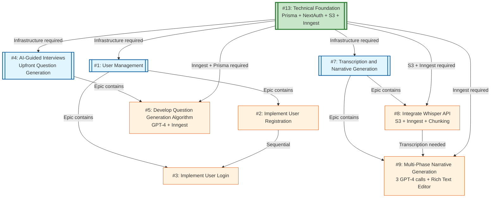
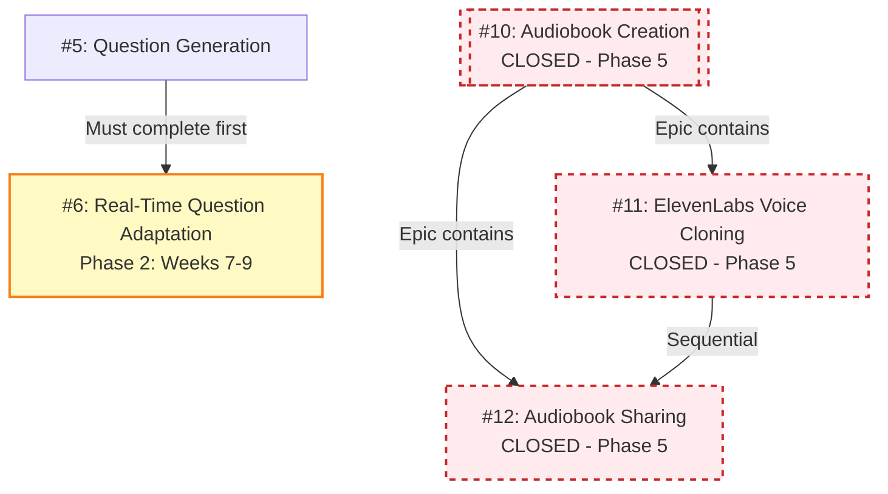

# Dependency Graph (MVP Focus)

## MVP Phase 1-3 (Weeks 1-6)



## Post-MVP (Deferred)



## Legend

**MVP Diagram:**
- **Green box (Foundation)**: Technical infrastructure (must complete first)
- **Blue boxes (Epics)**: Major feature areas
- **Orange boxes (Tasks)**: Specific implementation work
- **Arrow direction**: Dependency flow (A → B means B depends on A)

**Post-MVP Diagram:**
- **Yellow boxes**: Phase 2 features (weeks 7-9)
- **Red dashed boxes**: Closed issues (Phase 5, weeks 10-12)

## Critical Dependencies for MVP

### Technical Foundation (#13) - Start Immediately
**Must complete before any feature work:**
- Next.js 14+ project initialization
- **Prisma** ORM setup (database schema with 10 entities)
- **NextAuth.js v4** authentication
- **AWS S3** bucket configuration (presigned URLs)
- **Inngest** job queue setup (critical for async operations)
- **Sentry** error tracking
- Vercel deployment pipeline

**Timeline**: Week 1-3
**Estimated Effort**: 80-100 hours

### Parallel Tracks After Foundation

Once foundation is complete, work can proceed in parallel on three tracks:

**Track 1: User Management (#1)**
- #2: User Registration → #3: User Login
- Can start: Week 2
- Duration: 1 week

**Track 2: AI-Guided Interviews (#4)**
- #5: Question Generation (requires Inngest + Prisma)
- Can start: Week 3
- Duration: 1 week

**Track 3: Transcription & Narrative (#7)**
- #8: Whisper Integration (requires S3 + Inngest)
- #9: Narrative Generation (depends on #8, requires Inngest)
- Can start: Week 4
- Duration: 2 weeks

## Updated Architecture Requirements

### New Critical Components:

1. **Inngest Job Queue** - Required for:
   - Question generation (#5)
   - Audio transcription (#8)
   - Narrative generation (#9)
   - Why: Operations take 30s-5min (API routes timeout)

2. **AWS S3** - Required for:
   - Audio file storage (up to 500MB)
   - Presigned URL uploads
   - Why: Too large for API route bodies

3. **Multi-Phase Narrative** - Required for:
   - Quality narrative output
   - 3 GPT-4 calls: cleanup → structure → generate
   - Why: Single-pass produces poor results

## Deprioritized Features

### Phase 2 (Post-MVP, Weeks 7-9):
- **#6**: Real-Time Question Adaptation
  - Requires: WebSocket/SSE, streaming LLM
  - Can start after MVP launch

### Phase 5 (Weeks 10-12):
- **#10, #11, #12**: Voice cloning and audiobook features
  - Closed for MVP
  - Too expensive ($43.67 vs $2.67 COGS)
  - Will add standard TTS in Phase 4 first

## Development Workflow

For parallel development using git worktrees, run:
```bash
./confabulator/setup-worktrees.sh
```

## Quick Start Sequence

**Week 1-3: Foundation**
```bash
1. Initialize Next.js project
2. Set up Prisma with 10-entity schema
3. Configure NextAuth.js
4. Set up S3 buckets + presigned URLs
5. Initialize Inngest job queue
6. Deploy to Vercel staging
```

**Week 3-4: User Management + Questions**
```bash
1. Implement registration/login
2. Create question generation job
3. Build question preview/edit UI
```

**Week 4-5: Transcription + Narrative**
```bash
1. Implement S3 audio upload
2. Create transcription Inngest job
3. Create narrative generation job (3 phases)
4. Build rich text editor
5. Add PDF generation
```

**Week 6: Polish & Launch**
```bash
1. Stripe payment integration
2. PostHog analytics
3. Email notifications (Resend)
4. Security audit
5. Beta testing with 10 users
6. MVP LAUNCH 🚀
```

## Reference Documentation

- **Complete implementation plan**: `confabulator/implementation-plan.md`
- **Interview question strategy**: `confabulator/interview-question-roadmap.md`
- **Data model details**: `implementation-plan.md` lines 36-126
- **Job queue architecture**: `implementation-plan.md` lines 428-792
- **Security requirements**: `implementation-plan.md` lines 1120-1557
